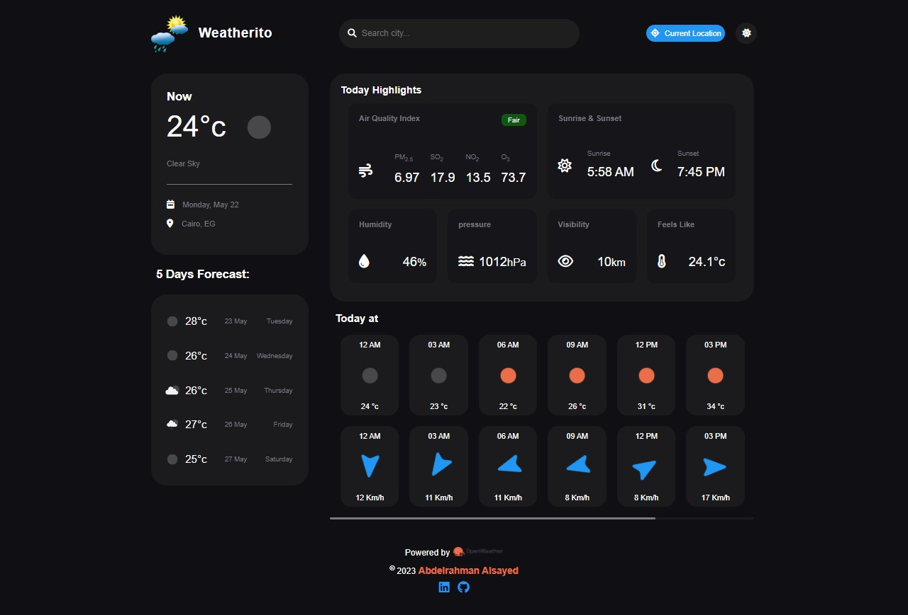
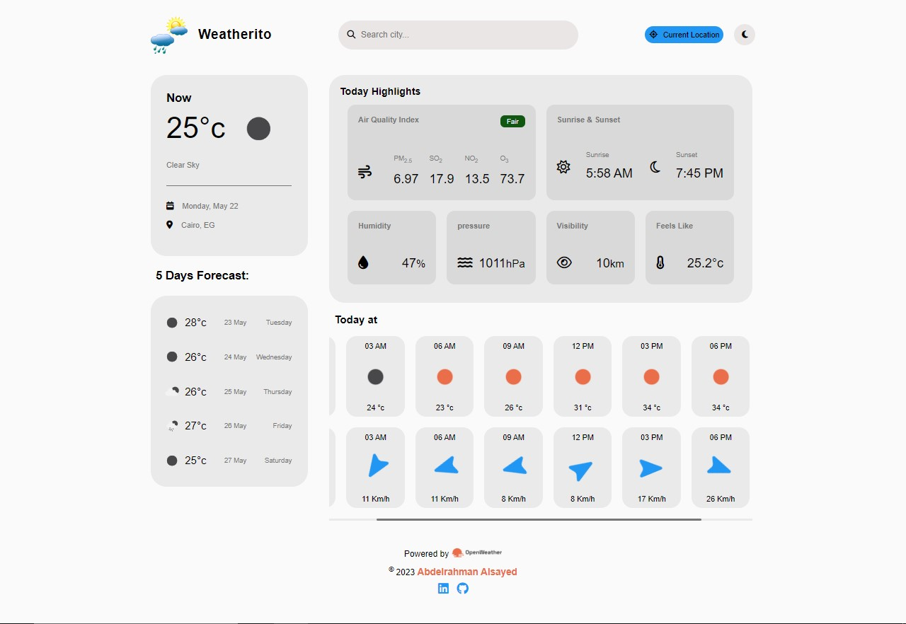

# **_Weather Dashboard_**

## **_Table of contents_**
* [Description of the project](#description-of-the-project)
* [Key Features](#key-features)
* [Technologies used](#technologies-used)
* [screenshots](#screenshots)
* [deployment](#deployment)

## **_Description of the project_**
This is a Weather Dashboard application designed to provide users with up-to-date and comprehensive weather information. With its user-friendly interface and intuitive design, the dashboard offers a range of features to help users stay informed about current conditions and forecasts.

## **_Key Features_**
* Current Location Weather: The Weather Dashboard offers a "Current Location" button or feature that allows users to retrieve weather information for their present geographical location.
* Geolocation Technology: This feature likely utilizes geolocation technology provided by the user's device or browser to determine their current location accurately.
* One-Click Access: By clicking the "Current Location" button, users can trigger the geolocation functionality, which automatically detects their latitude and longitude coordinates.
* Real-Time Weather Data: Once the geolocation is determined, the Weather Dashboard retrieves real-time weather data for that specific location, providing users with the current weather conditions for where they are at that moment.
* Current Weather: The Default for the Weather at this moment is Cairo, EG but also you can search for a specific city, get the search list and display the current weather conditions for this specific location, including temperature, humidity, wind speed and direction, precipitation, and visibility.
* Forecast: It offer a weather forecast for the upcoming 5 days, including predicted temperatures, precipitation chances, and general weather conditions.
* Search Functionality: Users are able to search for weather information for a particular city, town, or region. This could involve entering a location name in the search bar.
* Air Quality Index: The Weather Dashboard presents the Air Quality Index (AQI) as part of the "Today Highlights" section. The AQI provides information about the current air quality level, indicating the pollution levels and potential health impacts for the specified location.
* Sunrise & Sunset Times: The website includes the sunrise and sunset times for the selected location in the "Today Highlights" section. This information helps users plan their day and stay informed about daylight hours.
* Humidity: The Weather Dashboard displays the current humidity level as one of the highlights. Humidity represents the amount of moisture present in the air and can influence how the weather feels to individuals.
* Visibility: The website provides information about visibility in the "Today Highlights" section. Visibility refers to the distance at which objects can be clearly seen, impacted by factors such as fog, haze, or other atmospheric conditions.
* Pressure: The Weather Dashboard includes the atmospheric pressure reading as part of the "Today Highlights." Atmospheric pressure indicates the force exerted by the atmosphere and is typically measured in units like millibars (mb) or inches of mercury (inHg).
* Feels Like Temperature: The dashboard may display the "Feels Like" temperature, also known as the heat index or wind chill factor, depending on the weather conditions. It represents how the weather actually feels to a person, factoring in variables such as temperature, humidity, and wind.
* Hourly Daily Forecast: The Weather Dashboard offers a detailed daily forecast that provides weather information for each 3-hour interval throughout the day. This feature allows users to view the expected weather conditions, such as temperature, precipitation, wind speed, and other relevant parameters, for various time slots.
* Wind Speed: The daily forecast section provides information about the wind speed. This indicates the speed at which air is moving and is typically measured in kilometers per hour (km/h) or other relevant units.
* Light and Dark Mode: The Weather Dashboard offers both light and dark modes, allowing users to choose their preferred interface theme using the sun or moon icon and saved the preferred in the localStorage.
* Responsive Design: The website is designed to be responsive, ensuring it adapts and displays properly across different devices and screen sizes.

## **_Technologies used_**
Project is created using:
* HTML5
* CSS3
* Vanilla JavaScript
* Third party API
* fontAwesome library
* localStorage

## **_screenshots_**

## **deployment**
#### Live Site URL : <a href="https://abdelrahmanalsayed.github.io/Weather-Dashboard/" target="_blank">Live Site<a>

